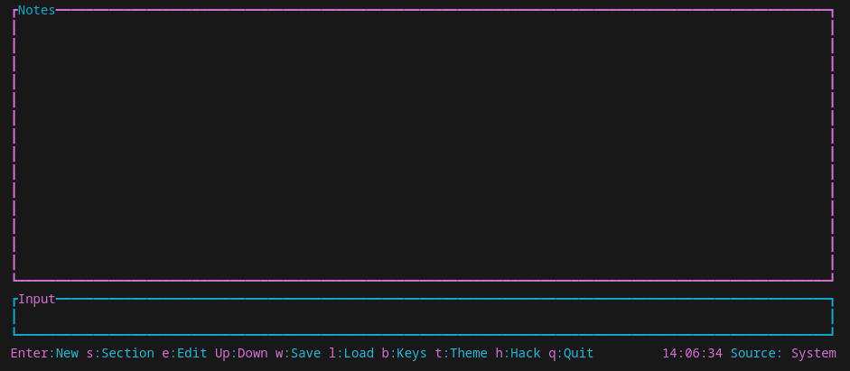

# Real Time Note Taker

**RTNT** is a terminal user interface for taking timestamped notes. Notes can be organized into titled sections and exported to CSV for further processing. All active key bindings are always visible at the bottom of the UI.



## Features

- Millisecond accurate timestamps
- Section markers to organize discussions
- Edit existing entries
- Save and load notes from CSV
- Fully keyboard driven with customizable bindings

## Installation

Add the binary with Cargo once the crate is published:

```bash
cargo install real_time_note_taker
```

## Running

```bash
cargo run --release
```

### Automatic file mode

Passing `--file <PATH>` will load notes from the given file and save them back on exit.

### Custom key bindings

Press the key shown as `Keys` in the help line to open the binding menu. Use the arrow keys to select an action and press <kbd>Enter</kbd> to assign a new key. Bindings are stored in `keybindings.json` inside the configuration directory (typically `~/.config/rtnt`).

## Library Usage

```rust
use real_time_note_taker::{run, App};

fn main() -> std::io::Result<()> {
    let app = App::new();
    let _app = run(app)?;
    Ok(())
}
```

## Saving location

Files are written to [`App::default_save_dir`] which resolves to a platform appropriate directory and is created on first use.

## License

This project is licensed under the MIT or Apache-2.0 licenses at your option.
